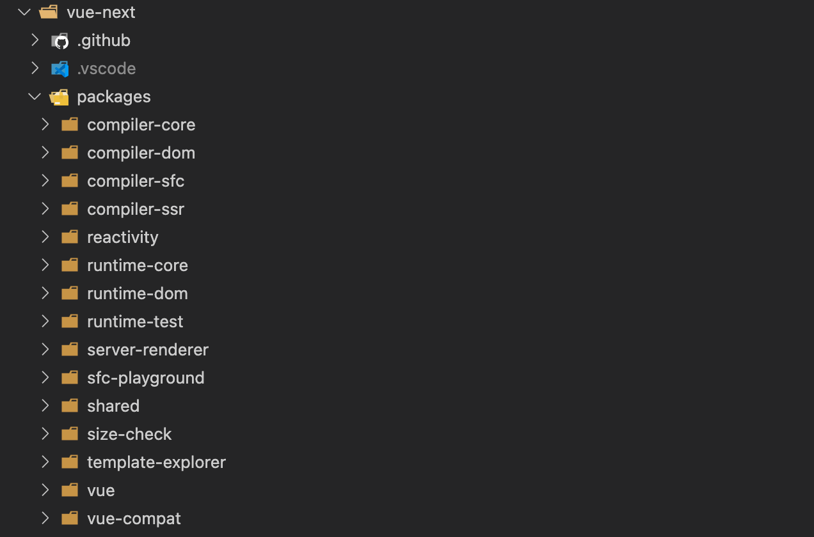
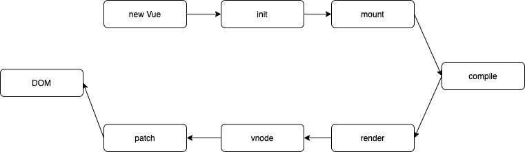
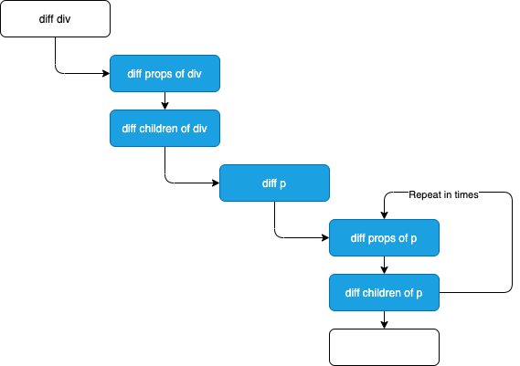

# Vue.js 3 的优化

先看一下 Vue.js 主要的优化内容

## 源码优化

1. **monorepo**

主要体现在使用 monorepo 和 TypeScript 管理和开发源码，这样做的目的是提升自身代码可维护性。



monorepo 把这些模块拆分到不同的 package 中，每个 package 有各自的 API、类型定义和测试。这样使得模块划分更加细化，职责划分更明确方便阅读。

另外例如 reactivity 是可以独立于 Vue 来使用的，现在如果我们想用响应式，并不需要去依赖整个 Vue.js。

2. **TypeScript**

使用类型语言非常有利于代码维护，因为可以在编码期间就做类型检查，很好避免因为类型问题导致的错误。Vue.js 3.0 抛弃了 Flow 改用 TypeScript。TypeScript 提供更好的类型检查，以及类型推导，另外也省去单独维护 .d.ts 的工作。

## 性能优化

1. **源码体积优化**

体积越小，意味着加载时间更快，解析的时间也更快。

Vue 3.0 首先移除了一些比较冷门的 feature（filter 等），其次，引入 tree-shaking 技术，减少打包 📦 的体积。

<nx-tip text="为什么说引入 tree-shaking? tree-shaking 的工作原理以及如何引入？"/>

2. **数据劫持优化**

Vue.js 区别于 React 的一大特性，就是它的数据是响应式的。DOM 是数据的一种映射，数据发生变化自动更新 DOM，我们只需要关系数据的修改就行。

为了实现这个功能，Vue.js 就必须劫持数据的访问和更新。

- 先说 DOM 更新。当数据变化之后，为了自动更新 DOM，那就必须劫持数据更新，这样当数据更新的时候能自动去执行一些逻辑去更新 DOM。
- 那怎么知道要更新哪些 DOM 呢？当渲染 DOM 的时候，肯定需要访问数据，这个时候就可以对它进行劫持，这样内部就建立了依赖，知道数据对应的 DOM 是什么。

Vue 2 是通过 `Objective.defineProperty` 这个 API 来实现数据的支持的：

```js
Objective.defineProperty(data, 'name', {
  get() {
    // 劫持访问
  },
  set() {
    // 触发更新
  }
})
```

但是这个 API 有个缺陷，**就是必须预先知道要拦截的 key！例如前面的 `name`，所以它不能检测对象属性的添加和删除**。尽管 Vue 提供了 `$set`、`$delete` 来解决这个问题，但是对用户来说还是增加一定的心智负担。

也因为这个缺陷，Vue 并不知道你在运行的时候使用哪个属性，所以他需要劫持每一个属性。**要实现这个目的就需要递归遍历整个对象，如果我们的对象比较复杂，嵌套很深，就会有很大的性能负担。**

```js
export default {
  data: {
    a: {
      b: {
        c: {
          d: {
            name: 'vue'
          }
        }
      }
    }
  }
}
```

为了解决上述的问题，Vue.js 3.0 使用 Proxy API 来做数据劫持：

```js
observed = new Proxy(data, {
  get() {
    // 劫持访问
  },
  set() {
    // 触发更新
  }
})
```

由于它劫持的是整个对象，自然对对象的属性增加、删除都能检测到。

需要注意 Proxy API 并不能监听内部深层次的数据变化，Vue.js 3.0 的处理方式是在 getter 中去递归响应式，这样的好处是真正访问到的内部对象才会变成响应式，而不是无脑递归，这样无疑也在很大程度上提升了性能

<nx-tip text="既然是真正使用的时候才变成响应式，为什么内部还是需要递归来做响应式？"/>

3. **编译优化**

为了更好理解，我们先看一下 Vue 渲染 DOM 的过程



前面说的数据劫持优化主要在 init 阶段，而 compile 流程可以使用 vue-loader 在编译阶段离线完成。想继续优化，那么我们可以在耗时较多的 patch 阶段想办法！Vue.js 30 也是怎么做的。

通过前面的数据劫持之后，Vue.js 2.x 的数据更新触发重新渲染的组件级的。**虽然保证更新的组件最小化，但是单个组件内部依然需要便利整个 vnode 树**。举个例子：

```js
<template>
  <div id="content">
    <p class="text">static text</p>
    <p class="text">static text</p>
    <p class="text">{{message}}</p>
    <p class="text">static text</p>
    <p class="text">static text</p>
  </div>
</template>
```

这段代码的整个 diff 过程如下：



**实际上只有一个动态节点，所以这里很多 diff 和遍历其实是不需要的，这会导致性能的浪费**。也就是说 vnode 的性能应该和动态节点数量相关，而不是和模板大小正相关。

为了解决这个问题 Vue.js 3.0 在模版编译阶段通过对静态模板的分析，编译生产 Block tree。借助 Block tree，Vue.js 将 vnode 的更新性能变为了和动态内容的数量相关，这是一个很大的性能突破！

## 语法优化 Composition API

除了源码和性能的优化，Vue.js 3.0 在语法上提供了 Composition API，对我们的代码组织和复用带来很大的好处！

1. **优化组织结构**

基于 Options API 的组件编写方式（逻辑分散）转化为基于组合的编写方式（逻辑收敛）

2. **优化逻辑复用**

当我们项目复杂的时候，不免的会抽象出一些复用的逻辑。在 2.x 中，我们一般会使用 mixins 去复用逻辑。但是随着 mixins 的复杂层度以及数量的增加，**会存在两个非常明显的问题：命名冲突和来源不明确**。

每个 mixin 都可以定义自己的 props、data，很容易就会定义相同的变量。而在组件中，使用不在当前组件定义的变量，也很难知道这些变量实际是在哪里定义的，这就是来源不明确。

使用 Composition API 就很好的解决这两个问题。同时它本身就是函数，所以有更好的类型支持。另外，它对 tree-shaking 更加友好，代码更容易压缩。


