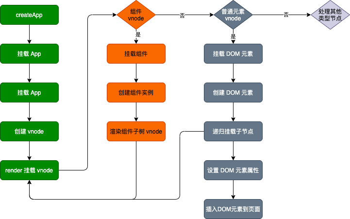

# 组件渲染，从 vnode 到 dom

前面提到的性能优化，我们看一下从 vnode 到 dom 是如何实现的？

组件是 Vue 一个非常重要的概念，可以把整个应用页面拆分成不同组件，最后把他们组装起来。例如自定义一个简单的组件

```html
<template>
  <div>
    <p>hello world</p>
  </div>
</template>
```

注册之后就可以直接通过 `<hello-world>` 来使用，接下来我看看一下从模板到渲染 DOM 的整个过程是怎么样的？

## 初始化

从应用程序的初始化开始。Vue.js 3.0 通过 `createApp` 函数创建一个新的应用实例.

```js
import Vue from 'vue';
import App from './app'
const app = Vue.createApp({App})
app.mount('#app')
```

我看一下 `createApp` 的代码：

```js
// vue-next/packages/runtime-dom/src/index.ts
export const createApp = ((...args) => {
  const app = ensureRenderer().createApp(...args)
  // ...
  const { mount } = app
  app.mount = (containerOrSelector: Element | ShadowRoot | string): any => {
    const container = normalizeContainer(containerOrSelector)
    if (!container) return

    const component = app._component
    if (!isFunction(component) && !component.render && !component.template) {
      // __UNSAFE__
      // Reason: potential execution of JS expressions in in-DOM template.
      // The user must make sure the in-DOM template is trusted. If it's
      // rendered by the server, the template should not contain any user data.
      component.template = container.innerHTML
      // 2.x compat check
      // ...
    }

    // clear content before mounting
    container.innerHTML = ''
    const proxy = mount(container, false, container instanceof SVGElement)
    if (container instanceof Element) {
      container.removeAttribute('v-cloak')
      container.setAttribute('data-v-app', '')
    }
    return proxy
  }

  return app
}) as CreateAppFunction<Element>
```

可以看到主要做了 2 件事：

- 创建 app 对象
- 重写 mount 方法

### 创建 app 对象

首先主要通过 `ensureRenderer().createApp(...args)` 创建 app 对象。其中 `ensureRenderer` 用来创建一个**渲染器对象**，它的实现如下：

```js
// vue-next/packages/runtime-dom/src/index.ts
function ensureRenderer() {
  return (
    renderer ||
    (renderer = createRenderer<Node, Element | ShadowRoot>(rendererOptions))
  )
}
// vue-next/packages/runtime-core/src/renderer.ts
export function createRenderer<
  HostNode = RendererNode,
  HostElement = RendererElement
>(options: RendererOptions<HostNode, HostElement>) {
  return baseCreateRenderer<HostNode, HostElement>(options)
}

function baseCreateRenderer(
  options: RendererOptions,
  createHydrationFns?: typeof createHydrationFunctions
): any {
  
  // 相关渲染函数定义
  // ...

  // 渲染函数
  const render: RootRenderFunction = (vnode, container, isSVG) => {
    if (vnode == null) {
      if (container._vnode) {
        unmount(container._vnode, null, null, true)
      }
    } else {
      patch(container._vnode || null, vnode, container, null, null, null, isSVG)
    }
    flushPostFlushCbs()
    container._vnode = vnode
  }

  return {
    render,
    createApp: createAppAPI(render, hydrate)
  }
```

`ensureRenderer` 最后返回的渲染器对象内部有一个 createApp 方法，它是 createAppAPI 返回的函数，接受 `rootComponent`、`rootProps` 两个参数。

我们在应用里执行 `createApp(App)` 的时候，会把 App 组件对象作为根组件传给 `rootComponent`，这样 `createApp` 内部就创建一个 `app` 对象。

### 重写 app.mount 方法

根据前面的分析，app 对象已经拥有一个 mount 方法，但在入口中却是对这个方法重写。

<nx-tip 
  text="思考一下，为什么要对它进行重写，而不是把相关的逻辑放在 app 对象的 mount 内部实现？"
  subText="这是因为 Vue.js 不仅仅是为 Web 平台服务，它的目标是支持跨平台渲染，而 createApp 函数内部的 app.mount 方法是一个标准的可跨平台的组件渲染流程，不应该包含任何特定平台的逻辑"
/>

```js
app.mount = (containerOrSelector: Element | ShadowRoot | string): any => {
  const container = normalizeContainer(containerOrSelector)
  if (!container) return

  const component = app._component
  if (!isFunction(component) && !component.render && !component.template) {
    // __UNSAFE__
    // Reason: potential execution of JS expressions in in-DOM template.
    // The user must make sure the in-DOM template is trusted. If it's
    // rendered by the server, the template should not contain any user data.
    component.template = container.innerHTML
    // 2.x compat check
    // ...
  }
  // ...
}
```

首先是通过 `normalizeContainer` 标准化容器（这里可以传字符串选择器或者 DOM 对象，但如果是字符串选择器，就需要把它转成 DOM 对象，作为最终挂载的容器）。

然后判断组件是否定义 `render` 或者 `template` 模板，没有则取容器的 `innerHTML` 作为组件模板内容。

在挂在前清空容器内容，最后调用 `app.mount` 的方法走**标准的渲染流程**。

## 渲染流程：创编 vnode 和渲染 vnode

### 创建 vnode

> vnode 本质上是用来描述 DOM 的 JavaScript 对象，它在 Vue.js 中可以描述不同类型的节点，比如普通元素节点、组件节点等

以前面 `<hello-world>` 为例

```js
<template>
  <div>
    <p class="text">hello world</p>
  </div>
</template>

// 用 vnode 来表示
const vnode = {
  type: 'div',
  children: [
    {
      type: 'p',
      props: {
        'class': 'text'
      },
      text: 'hello world'
    }
  ]
}
```

上面这些都是普通元素节点，那什么是组件节点呢？实际上 vnode 也可以用来描述组件，方式和前面一致。例如我们在 hello-world 再引入一个组件 `<custom-component>`，用 vnode 来表示这个组件标签：

```js
const CustomComponent = {
  // 在这里定义组件对象
}
const vnode = {
  type: CustomComponent,
  props: { 
    msg: 'vue'
  }
}
```

除了前面这两种还是有：
- 纯文本 vnode
- 注释 vnode
- ...

<nx-tip
  text="知道什么是 vnode 之后，思考一下 vnode 有什么优势呢？为什么一定要设计 vnode 这样的数据结构呢？"
  subText="首先是抽象，引入 vnode，可以把渲染过程抽象化，从而使得组件的抽象能力也得到提升。其次是跨平台，因为 patch vnode 的过程不同平台可以有自己的实现，基于 vnode 再做服务端渲染、Weex 平台、小程序平台的渲染都变得容易了很多。"
/>

**值得注意的是：**
- 使用 vnode 不是不操作 DOM：实际上渲染 dom 还是需要调用底层的 API 去操作 DOM 的
- vnode 性能不一定比手动操作更好：每次 render -> vnode 都需要一定的 javascript 耗时，加上 path vnode 的过程也需要一定的耗时，当我们更新数据量很大的组件的时候，用户感觉到明显卡顿，所以性能并不是 vnode 的优点。

接下来看一下在 Vue 里是如何创建 vnode 的

```js
// vue-next/packages/runtime-core/src/apiCreateApp.ts
mount(
  rootContainer: HostElement,
  isHydrate?: boolean,
  isSVG?: boolean
): any {
  if (!isMounted) {
    const vnode = createVNode(
      rootComponent as ConcreteComponent,
      rootProps
    )
    // store app context on the root VNode.
    // this will be set on the root instance on initial mount.
    vnode.appContext = context
    if (isHydrate && hydrate) {
      hydrate(vnode as VNode<Node, Element>, rootContainer as any)
    } else {
      render(vnode, rootContainer, isSVG)
    }
    isMounted = true
    app._container = rootContainer

    return vnode.component!.proxy
  }
},

// vue-next/packages/runtime-core/src/vnode.ts
export const createVNode = (
  __DEV__ ? createVNodeWithArgsTransform : _createVNode
) as typeof _createVNode

function _createVNode(
  type: VNodeTypes | ClassComponent | typeof NULL_DYNAMIC_COMPONENT,
  props: (Data & VNodeProps) | null = null,
  children: unknown = null,
  patchFlag: number = 0,
  dynamicProps: string[] | null = null,
  isBlockNode = false
): VNode {
  // class component normalization.
  if (isClassComponent(type)) {
    type = type.__vccOpts
  }

  // 2.x async/functional component compat
  if (__COMPAT__) {
    type = convertLegacyComponent(type, currentRenderingInstance)
  }

  // class & style normalization.
  if (props) {
    // for reactive or proxy objects, we need to clone it to enable mutation.
    props = guardReactiveProps(props)!
    let { class: klass, style } = props
    if (klass && !isString(klass)) {
      props.class = normalizeClass(klass)
    }
    if (isObject(style)) {
      // reactive state objects need to be cloned since they are likely to be
      // mutated
      if (isProxy(style) && !isArray(style)) {
        style = extend({}, style)
      }
      props.style = normalizeStyle(style)
    }
  }

  // encode the vnode type information into a bitmap
  const shapeFlag = isString(type)
    ? ShapeFlags.ELEMENT
    : __FEATURE_SUSPENSE__ && isSuspense(type)
    ? ShapeFlags.SUSPENSE
    : isTeleport(type)
    ? ShapeFlags.TELEPORT
    : isObject(type)
    ? ShapeFlags.STATEFUL_COMPONENT
    : isFunction(type)
    ? ShapeFlags.FUNCTIONAL_COMPONENT
    : 0

  return createBaseVNode(
    type,
    props,
    children,
    patchFlag,
    dynamicProps,
    shapeFlag,
    isBlockNode,
    true
  )
}
```

可以看到 createVNode 的事情主要包括：

- 对 props 做标准化处理
- 对 vnode 进行类型编码
- 创建 vnode

得到一个 vnode 对象之后，我们看一下它是如何渲染的？

### 渲染 vnode

在 app.mount 函数中，得到 vnode 之后，接下下来就会调用 render 去渲染 vnode

```js
// vue-next/packages/runtime-core/src/apiCreateApp.ts
mount(
  rootContainer: HostElement,
  isHydrate?: boolean,
  isSVG?: boolean
): any {
  if (!isMounted) {
    const vnode = createVNode(
      rootComponent as ConcreteComponent,
      rootProps
    )
  // ...
  render(vnode, rootContainer, isSVG)
  }
}

// vue-next/packages/runtime-core/src/renderer.ts
// baseCreateRenderer
const render: RootRenderFunction = (vnode, container, isSVG) => {
  if (vnode == null) {
    if (container._vnode) {
      unmount(container._vnode, null, null, true)
    }
  } else {
    patch(container._vnode || null, vnode, container, null, null, null, isSVG)
  }
  flushPostFlushCbs()
  container._vnode = vnode
}
```

`render` 函数很简单，如果第一个参数 vnode 为空，则执行 `unmount` 销毁组件，否则执行 `patch` 进行创建或者更新组件。

接下来看一下 `patch` 的实现：

```js
// vue-next/packages/runtime-core/src/renderer.ts
// baseCreateRenderer
const patch: PatchFn = (
  n1,
  n2,
  container,
  anchor = null,
  parentComponent = null,
  parentSuspense = null,
  isSVG = false,
  slotScopeIds = null,
  optimized = __DEV__ && isHmrUpdating ? false : !!n2.dynamicChildren
) => {
  if (n1 === n2) {
    return
  }

  // patching & not same type, unmount old tree
  if (n1 && !isSameVNodeType(n1, n2)) {
    anchor = getNextHostNode(n1)
    unmount(n1, parentComponent, parentSuspense, true)
    n1 = null
  }

  if (n2.patchFlag === PatchFlags.BAIL) {
    optimized = false
    n2.dynamicChildren = null
  }

  const { type, ref, shapeFlag } = n2
  switch (type) {
    case Text:
      processText(n1, n2, container, anchor)
      break
    case Comment:
      processCommentNode(n1, n2, container, anchor)
      break
    case Static:
      if (n1 == null) {
        mountStaticNode(n2, container, anchor, isSVG)
      } else if (__DEV__) {
        patchStaticNode(n1, n2, container, isSVG)
      }
      break
    case Fragment:
      processFragment(
        n1,
        n2,
        container,
        anchor,
        parentComponent,
        parentSuspense,
        isSVG,
        slotScopeIds,
        optimized
      )
      break
    default:
      if (shapeFlag & ShapeFlags.ELEMENT) {
        processElement(
          n1,
          n2,
          container,
          anchor,
          parentComponent,
          parentSuspense,
          isSVG,
          slotScopeIds,
          optimized
        )
      } else if (shapeFlag & ShapeFlags.COMPONENT) {
        processComponent(
          n1,
          n2,
          container,
          anchor,
          parentComponent,
          parentSuspense,
          isSVG,
          slotScopeIds,
          optimized
        )
      } else if (shapeFlag & ShapeFlags.TELEPORT) {
        ;(type as typeof TeleportImpl).process(
          n1 as TeleportVNode,
          n2 as TeleportVNode,
          container,
          anchor,
          parentComponent,
          parentSuspense,
          isSVG,
          slotScopeIds,
          optimized,
          internals
        )
      } else if (__FEATURE_SUSPENSE__ && shapeFlag & ShapeFlags.SUSPENSE) {
        ;(type as typeof SuspenseImpl).process(
          n1,
          n2,
          container,
          anchor,
          parentComponent,
          parentSuspense,
          isSVG,
          slotScopeIds,
          optimized,
          internals
        )
      } else if (__DEV__) {
        warn('Invalid VNode type:', type, `(${typeof type})`)
      }
  }

  // set ref
  if (ref != null && parentComponent) {
    setRef(ref, n1 && n1.ref, parentSuspense, n2 || n1, !n2)
  }
}
```

这个函数有 2 个重要左右：

- 根据 vnode 挂载 DOM
- 根据新旧 vnode 更新 DOM

它接受多个参数，这里重点关注：

- n1：**表示旧的 vnode**，如果是 null，则表示是一次挂载过程
- n2：**表示新的 vnode**，会根据这个 vnode 的类型执行不同逻辑
- container：**DOM 容器**，也就是 vnode 渲染成 DOM 之后会挂载到 container 下面

我们挂载的是一个 App 组件，所以先看一下对组件的处理，也就是 `processComponent`：

```js
const processComponent = (
  n1: VNode | null,
  n2: VNode,
  container: RendererElement,
  anchor: RendererNode | null,
  parentComponent: ComponentInternalInstance | null,
  parentSuspense: SuspenseBoundary | null,
  isSVG: boolean,
  slotScopeIds: string[] | null,
  optimized: boolean
) => {
  n2.slotScopeIds = slotScopeIds
  if (n1 == null) {
    if (n2.shapeFlag & ShapeFlags.COMPONENT_KEPT_ALIVE) {
      ;(parentComponent!.ctx as KeepAliveContext).activate(
        n2,
        container,
        anchor,
        isSVG,
        optimized
      )
    } else {
      // 挂载组件
      mountComponent(
        n2,
        container,
        anchor,
        parentComponent,
        parentSuspense,
        isSVG,
        optimized
      )
    }
  } else {
    // 更新组件
    updateComponent(n1, n2, optimized)
  }
}
```

逻辑比较简单，就是根据 `n1` 是否存在来决定是渲染组件还是更新组件。我们接下来看 `mountComponent`：

```js
const mountComponent: MountComponentFn = (
    initialVNode,
    container,
    anchor,
    parentComponent,
    parentSuspense,
    isSVG,
    optimized
  ) => {
    // 2.x compat may pre-creaate the component instance before actually
    // mounting
    const compatMountInstance =
      __COMPAT__ && initialVNode.isCompatRoot && initialVNode.component
    // 创建组件实例
    const instance: ComponentInternalInstance =
      compatMountInstance ||
      (initialVNode.component = createComponentInstance(
        initialVNode,
        parentComponent,
        parentSuspense
      ))

    // resolve props and slots for setup context
    if (!(__COMPAT__ && compatMountInstance)) {
      if (__DEV__) {
        startMeasure(instance, `init`)
      }
      // 设置组件实例
      setupComponent(instance)
      if (__DEV__) {
        endMeasure(instance, `init`)
      }
    }

    // setup() is async. This component relies on async logic to be resolved
    // before proceeding
    if (__FEATURE_SUSPENSE__ && instance.asyncDep) {
      parentSuspense && parentSuspense.registerDep(instance, setupRenderEffect)

      // Give it a placeholder if this is not hydration
      // TODO handle self-defined fallback
      if (!initialVNode.el) {
        const placeholder = (instance.subTree = createVNode(Comment))
        processCommentNode(null, placeholder, container!, anchor)
      }
      return
    }
    // 设置并运行带副作用的渲染函数
    setupRenderEffect(
      instance,
      initialVNode,
      container,
      anchor,
      parentSuspense,
      isSVG,
      optimized
    )

    if (__DEV__) {
      popWarningContext()
      endMeasure(instance, `mount`)
    }
  }
```

它主要做三件事：

- 创建组件实例：Vue.js 3.0 虽然不像 Vue.js 2.x 那样**通过类的方式**去实例化组件，但内部也通过对象的方式去创建了当前渲染的组件实例。
- 设置组件实例：instance 保留了很多组件相关的数据，维护了组件的上下文，包括对 props、插槽，以及其他实例的属性的初始化处理
- 设置并运行带副作用的渲染函数

我们看一下 `setupRenderEffect`：

```js
const setupRenderEffect: SetupRenderEffectFn = (
  instance,
  initialVNode,
  container,
  anchor,
  parentSuspense,
  isSVG,
  optimized
) => {
  const componentUpdateFn = () => {
    //... 
  }

  // create reactive effect for rendering
  const effect = new ReactiveEffect(
    componentUpdateFn,
    () => queueJob(instance.update),
    instance.scope // track it in component's effect scope
  )

  const update = (instance.update = effect.run.bind(effect) as SchedulerJob)
  update.id = instance.uid
  // allowRecurse
  // #1801, #2043 component render effects should allow recursive updates
  effect.allowRecurse = update.allowRecurse = true

  if (__DEV__) {
    effect.onTrack = instance.rtc
      ? e => invokeArrayFns(instance.rtc!, e)
      : void 0
    effect.onTrigger = instance.rtg
      ? e => invokeArrayFns(instance.rtg!, e)
      : void 0
    // @ts-ignore (for scheduler)
    update.ownerInstance = instance
  }

  update()
}
```

首先定义一个组件组件更新函数 `componentUpdateFn`，然后用响应式库的 `ReactiveEffect` 创建一个 `effect` 对象，当数据变化的时候，`componentUpdateFn` 会重新执行一遍，从而达到重新渲染的目的。

<nx-tip text="怎么理解这里的副作用？"/>

我们重点看一下前面定义的，组件更新函数 `componentUpdateFn`，这里先只关注渲染流程：

```js
const componentUpdateFn = () => {
  if (!instance.isMounted) {
    let vnodeHook: VNodeHook | null | undefined
    const { el, props } = initialVNode
    const { bm, m, parent } = instance
    // beforeMount hook
    if (bm) {
      invokeArrayFns(bm)
    }

    // ...
    const subTree = (instance.subTree = renderComponentRoot(instance))
    patch(
      null,
      subTree,
      container,
      anchor,
      instance,
      parentSuspense,
      isSVG
    )
    // ...
  }
}
```

**初始渲染主要做两件事情：渲染组件生成 subTree、把 subTree 挂载到 container 中** 

首先，是渲染组件生成 `subTree`，它也是一个 vnode 对象。我们知道每个组件都会有对应的 `render` 函数，即使你写 `template`，也会编译成 `render` 函数，**而 `renderComponentRoot` 函数就是去执行 `render` 函数创建整个组件树内部的 vnode**，把这个 vnode 再经过内部一层标准化，就得到了该函数的返回结果：子树 vnode。

渲染生成子树 vnode 后，接下来就是继续调用 `patch` 函数把子树 vnode 挂载到 `container` 中了。

再次回到了 `patch` 函数，会继续对这个子树 vnode 类型进行判断，对于上述例子，App 组件的根节点是 `<div>` 标签，那么对应的子树 vnode 也是一个普通元素 vnode，那么我们接下来看**对普通 DOM 元素的处理流程**。

```js
const processElement = (
  n1: VNode | null,
  n2: VNode,
  container: RendererElement,
  anchor: RendererNode | null,
  parentComponent: ComponentInternalInstance | null,
  parentSuspense: SuspenseBoundary | null,
  isSVG: boolean,
  slotScopeIds: string[] | null,
  optimized: boolean
) => {
  isSVG = isSVG || (n2.type as string) === 'svg'
  if (n1 == null) {
    mountElement(
      n2,
      container,
      anchor,
      parentComponent,
      parentSuspense,
      isSVG,
      slotScopeIds,
      optimized
    )
  } else {
    patchElement(
      n1,
      n2,
      parentComponent,
      parentSuspense,
      isSVG,
      slotScopeIds,
      optimized
    )
  }
}
```

该函数的逻辑很简单，如果 `n1` 为 `null`，走挂载元素节点的逻辑，否则走更新元素节点逻辑

接着来看挂载元素的 `mountElement` 函数的实现：

```js
const mountElement = (
  vnode: VNode,
  container: RendererElement,
  anchor: RendererNode | null,
  parentComponent: ComponentInternalInstance | null,
  parentSuspense: SuspenseBoundary | null,
  isSVG: boolean,
  slotScopeIds: string[] | null,
  optimized: boolean
) => {
  let el: RendererElement
  let vnodeHook: VNodeHook | undefined | null
  const { type, props, shapeFlag, transition, patchFlag, dirs } = vnode
  if (
    !__DEV__ &&
    vnode.el &&
    hostCloneNode !== undefined &&
    patchFlag === PatchFlags.HOISTED
  ) {
    // ...
  } else {
    // 创建 DOM 节点
    el = vnode.el = hostCreateElement(
      vnode.type as string,
      isSVG,
      props && props.is,
      props
    )

    // mount children first, since some props may rely on child content
    // being already rendered, e.g. `<select value>`
    if (shapeFlag & ShapeFlags.TEXT_CHILDREN) {
      hostSetElementText(el, vnode.children as string)
    } else if (shapeFlag & ShapeFlags.ARRAY_CHILDREN) {
      // 处理子节点是数组的情况
      mountChildren(
        vnode.children as VNodeArrayChildren,
        el,
        null,
        parentComponent,
        parentSuspense,
        isSVG && type !== 'foreignObject',
        slotScopeIds,
        optimized
      )
    }
    // props
    // 处理 props，比如 class、style、event 等属性
    if (props) {
      for (const key in props) {
        if (key !== 'value' && !isReservedProp(key)) {
          hostPatchProp(
            el,
            key,
            null,
            props[key],
            isSVG,
            vnode.children as VNode[],
            parentComponent,
            parentSuspense,
            unmountChildren
          )
        }
      }
    }
    // scopeId
    setScopeId(el, vnode, vnode.scopeId, slotScopeIds, parentComponent)
  }
  // 把创建的 DOM 元素节点挂载到 container 上
  hostInsert(el, container, anchor)
}
```

挂载元素函数主要做四件事：创建 DOM 元素节点、处理 children、处理 props、挂载 DOM 元素到 container 上。

- 创建 DOM 元素节点

通过 `hostCreateElement` 方法创建，这是一个平台相关的方法，我们来看一下它在 Web 环境下的定义：

```js
function setElementText(el, text) {
  el.textContent = text
}
```

- 处理 children

```js
const mountChildren: MountChildrenFn = (
  children,
  container,
  anchor,
  parentComponent,
  parentSuspense,
  isSVG,
  slotScopeIds,
  optimized,
  start = 0
) => {
  for (let i = start; i < children.length; i++) {
    // 预处理优化
    const child = (children[i] = optimized
      ? cloneIfMounted(children[i] as VNode)
      : normalizeVNode(children[i]))
    patch(
      null,
      child,
      container,
      anchor,
      parentComponent,
      parentSuspense,
      isSVG,
      slotScopeIds,
      optimized
    )
  }
}
```

遍历 `children` 获取到每一个 `child`，然后递归执行 `patch` 方法挂载每一个 `child` 。

<nx-tip text="这里有对 child 做预处理的情况作用是什么？"/>

`mountChildren` 函数的第二个参数是 `container`，而我们调用 `mountChildren` 方法传入的第二个参数是在 `mountElement` 时创建的 DOM 节点，这就很好地建立了父子关系。

- 挂载 DOM 

`hostInsert(el, container, anchor)` 在 Web 环境定义如下：

```js
function insert(child, parent, anchor) {
  if (anchor) {
    parent.insertBefore(child, anchor)
  }
  else {
    parent.appendChild(child)
  }
}

```

**因为 `insert` 的执行是在处理子节点后，所以挂载的顺序是先子节点，后父节点，最终挂载到最外层的容器上。**

通过这种递归的方式，无论组件的嵌套层级多深，都可以完成整个组件树的渲染。

## 总结

整个过程如下：

